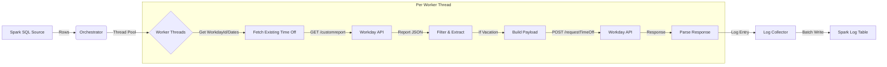

# Workday Time Off Ingestion & Processing

This project provides a robust, concurrent Python script for processing Time Off data from a Spark-based Lakehouse, validating it against Workday reports, and posting updates back to Workday.

## 1. Architecture Overview

The system follows a Source -> Process -> Sink pattern, utilizing multi-threading for efficient API interaction.



## 2. Components

- **`workday_time_off.py`**: Main script containing all logic (Auth, Data Fetching, API Execution, Logging).
- **Spark Environment**: Requires PySpark and `requests` library.

## 3. Data Schemas

### 3.1 Source: Spark SQL Query
The script expects a Spark DataFrame with the following columns:

| Column Name | Type | Description |
|---|---|---|
| `WorkdayId` | String | The Workday Worker ID (used in API URLs) |
| `Timecard_post_date` | Date/String | Used as `promptDate1` for the report |
| `timecard_worked_date` | Date/String | Used as `date` for the report |
| `hrs` | Double | The hours to be posted |

### 3.2 API: Workday Time Off Report (GET)
Expected JSON structure for each entry in `Report_Entry` list:

```json
{
  "timeOffType": {
    "descriptor": "Vacation Time Off",
    "id": "..." 
  },
  "timeOffEntryWid": "...", 
  "units": "8"
}
```
*Note: The script includes robust logic to handle variations in keys (e.g., `Time_Off_Type`, `WID`).*

### 3.3 API: Workday Request Time Off (POST)
Payload sent to Workday:

```json
{
  "days": [
    {
      "dailyQuantity": "8.0",
      "comment": "INT0137",
      "timeOffType": {
        "descriptor": "Vacation Time Off",
        "id": "time_off_entry_wid_from_get"
      },
      "date": "2026-01-01T08:00:00.000Z"
    }
  ]
}
```

### 3.4 Sink: Log Table (`workday_time_off_logs`)
The script writes a Delta table with the following schema (inferred from JSON):

| Column | Description |
|---|---|
| `worker_id` | Workday ID processed |
| `request_date` | Date of the time off |
| `success` | Boolean (True/False) |
| `http_status` | HTTP Code (e.g., 200, 400) |
| `transactionStatus` | Workday Business Process status |
| `descriptor` | Description of the created/updated item |
| `timestamp` | Execution timestamp |
| `error` | Error message (if failed) |

## 4. Configuration

Edit the `__main__` block in `workday_time_off.py` to set your credentials:

```python
CLIENT_ID = "your_client_id"
CLIENT_SECRET = "your_client_secret"
REFRESH_TOKEN = "your_refresh_token"
TOKEN_ENDPOINT = "https://wd3-impl-services1.workday.com/ccx/oauth2/nrf3/token"
TIMEOFF_REPORT_ENDPOINT = "..."
```

## 5. Usage

### Dry Run (Testing)
To test the flow (Fetch -> Parse -> Log) without actually modifying Workday data:

```python
ingest_time_off_process(..., dry_run=True)
```
*   Mock success logs will be generated.
*   GET requests are still performed (unless no data is returned, then mock data is used).

### Production Run
To execute actual POST requests:

```python
ingest_time_off_process(..., dry_run=False)
```

## 6. Extending the Script
The script is modular:
1.  **Add new Payload**: Create a new function like `build_sick_leave_payload(...)`.
2.  **Add new API Action**: Call `execute_post_request` with a different URL and your new payload.

