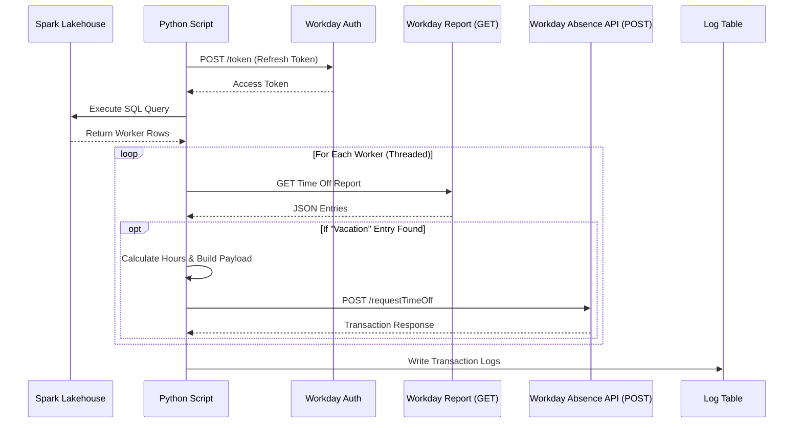

# Technical Specification: Workday Time Off Integration

## 1. Executive Summary
This document outlines the technical implementation for the **Workday Time Off Ingestion & Processing** system. This system automates the synchronization of time-off data from an internal Lakehouse (Spark) to the Workday HCM system. It utilizes a multi-threaded architecture to handle high volumes of data efficiently.

---

## 2. System Architecture

### 2.1 High-Level Flow
The system operates as a **Python script** execution within a Spark environment (e.g., Databricks, Synapse).

1.  **Authentication**: OAuth 2.0 (Refresh Token Flow) to obtain a Bearer Token.
2.  **Data Extraction**: Spark SQL query execution to identify target worker records.
3.  **Validation & Enrichment (GET)**: For each worker, queries a Workday Custom Report (RaaS) to validate existing time-off entries.
4.  **Transaction Processing (POST)**: Sends specific updates/requests to the Workday Absence Management API.
5.  **Logging**: Captures detailed transaction logs (Success/Failure) into a Delta Table for auditability.



---

## 3. API Specifications

### 3.1 Authentication
*   **Endpoint**: `.../ccx/oauth2/nrf3/token`
*   **Method**: `POST`
*   **Authentication**: Basic Auth (`Client ID` + `Client Secret`)
*   **Payload**: `grant_type=refresh_token`, `refresh_token=...`

### 3.2 Data Retrieval (GET Request)
This request fetches the current state of time-off entries for a worker to validate "Vacation" types before posting updates.

*   **Service**: Custom Report (RaaS)
*   **Method**: `GET`
*   **Headers**:
    *   `Authorization`: `Bearer <Access Token>`
    *   `Accept`: `application/json`
*   **Query Parameters**:
    *   `promptDate1`: Period Start Date (e.g., `2025-01-01-08:00`)
    *   `date`: Target Date (e.g., `2025-01-06-08:00`)
    *   `Colleague_ID`: Worker Identifier
    *   `Include_Terminated_Workers`: `0`
    *   `format`: `json`

**Sample Response (JSON):**
```json
{
  "Report_Entry": [
    {
      "timeOffType": {
        "descriptor": "Vacation Time Off",
        "id": "f280e2cea071100217d554f56cb40000"
      },
      "timeOffEntryWid": "d4b6062ffea51001b8b195b7fef10000",
      "units": "8",
      "date": "2026-01-06"
    }
  ]
}
```

### 3.3 Data Submission (POST Request)
This request submits the Time Off Request/Update to the Workday Absence Management API.

*   **Endpoint**: `.../ccx/api/absenceManagement/v3/nrf3/workers/{WorkdayID}/requestTimeOff`
*   **Method**: `POST`
*   **Headers**:
    *   `Authorization`: `Bearer <Access Token>`
    *   `Content-Type`: `application/json`

**Request Body Schema:**
The payload defines the specific days and quantities to request.
```json
{
  "days": [
    {
      "date": "2026-01-06T08:00:00.000Z",
      "dailyQuantity": "8",
      "comment": "INT0137",
      "timeOffType": {
        "id": "d4b6062ffea51001b8b195b7fef10000",  <-- Mapped from GET 'timeOffEntryWid'
        "descriptor": "Vacation Time Off"
      }
    }
  ]
}
```

**Response Body Schema (Success):**
Returns the created transaction details.
```json
{
  "days": [
    {
      "id": "d4b6062ffea51001b8b195b7fef10000",
      "descriptor": "01/06/2026 - 8 Hours (Worker Name)",
      "date": "2026-01-06",
      "dailyQuantity": "8"
    }
  ],
  "businessProcessParameters": {
    "transactionStatus": {
      "descriptor": "Successfully Completed",
      "id": "..."
    }
  }
}
```

---

## 4. Database Schema Definitions

### 4.1 Source Table (Spark SQL)
| Column Name | Type | Description |
|---|---|---|
| `WorkdayId` | String | Target Worker ID used in API URLs. |
| `Timecard_post_date` | Date | The context date for the report prompt. |
| `timecard_worked_date` | Date | The specific date of the time off. |
| `hrs` | Double | The quantity of hours to update. |

### 4.2 Output Log Table (`workday_time_off_logs`)
| Column Name | Type | Description |
|---|---|---|
| `worker_id` | String | The ID of the worker processed. |
| `request_date` | Date | The date of the time off event. |
| `success` | Boolean | `true` if API returned 200/201, else `false`. |
| `http_status` | Integer | HTTP Status Code (200, 400, 500, etc.). |
| `transactionStatus` | String | Business Process status (e.g., "Successfully Completed"). |
| `timeOffType_descriptor`| String | The type of time off processed (e.g., "Vacation"). |
| `timestamp` | Timestamp | UTC timestamp of when the script ran. |
| `error` | String | Error message details if failed. |

---

## 5. Configuration & Usage

### 5.1 Prerequisites
*   Python 3.x Environment (Spark/Databricks)
*   `requests` library installed
*   Workday OAuth Client ID, Secret, and Refresh Token

### 5.2 Execution
The script is designed to be run as a Spark Job.

**Dry Run Mode (Safe Testing):**
Set `dry_run=True`. The script will fetch data and log what *would* happen, but will NOT send POST requests.
```python
ingest_time_off_process(..., dry_run=True)
```

**Production Mode:**
Set `dry_run=False`. The script will actively update Workday.
```python
ingest_time_off_process(..., dry_run=False)
```
